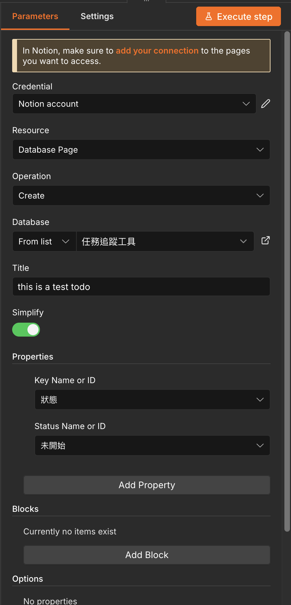

# 管理 n8n 的使用者認證

1. 進入 n8n Web UI，點開左邊側邊欄
2. 上面有一個加號，按下後選 New Crendential
3. 選 Notion
4. Redirect URL 不用改

到這一步時請先去建立 Notion Connection 服務再繼續

5. 放入 Client ID 和 Secret
6. 按下畫面上的 Sign in with Notion 按鈕

# 註冊 Notion Connection

https://app.notion.com/developers

1. 左邊欄選 Connection (四個方塊的圖案)
2. New Connection
3. 驗證方式選 OAuth
4. 其他東西自己填開心
5. 重新導向 URI 填 n8n 上顯示的 Redirect URL
6. 建立

# 將 Connection 加入想要被編輯的頁面

你可能需要建立一個新的頁面做測試用。

https://www.notion.com/help/add-and-manage-connections-with-the-api#add-connections-to-pages

# 在 n8n Notion Node 裡面設定要對 Notion 做什麼操作

目前用的是 `Create a database page` 節點

點進去可以設定來源，要寫入新頁面的 Title，和要加上的屬性。以下是參考設定

可以直接按 execute step 來測試。
